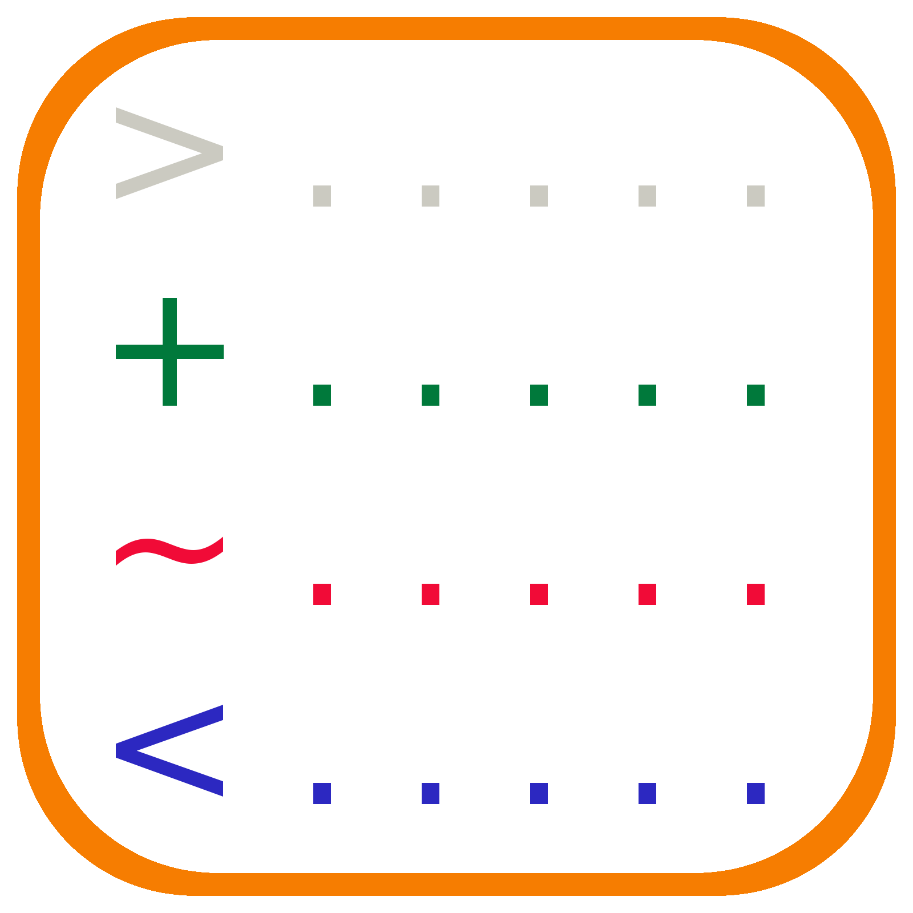
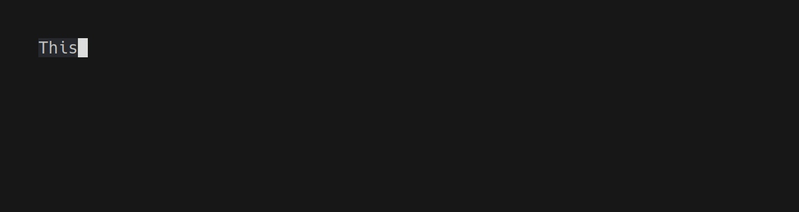

# auxilium

<p align="center">
  
</p>

<br /><br />

auxilium is an application that will take a configuration file of one to many "steps" that will be executed one after another to simulate what you would normally type during a lab or a demo. In this way you have a structured and easy to run approach to your demo, minimising variations in the demo, while still running live commands allowing a second terminal to perform additional adhoc actions or other investigations as the group your demo-ing to will take you.

These actions and configurations, listed below can be used for run other programs, commands or simply output text.

## Demo

This gif runs through how the [demo auxilium configuration](./test/demo.aux.yml) looks, including user inputs.



**Note:** Ironically the auxilium demo was captured  with [charm's VHS](https://github.com/charmbracelet/vhs) which contains a lot of the functionality intended with auxilium, though with additional features, functionality, and polish. Hence most people should use [VHS](https://github.com/charmbracelet/vhs) over auxilium.

## Command help

```bash
$ auxilium

auxilium is an application which will read a provided configuration file to run through example CLI scripts with
custom text explaining the process. It's used as a way to write a CLI demo, which runs live commands, allowing for
easier proding in another shell, while also being scripted to ensure the right execution order and pacing.

Usage:
  auxilium [flags]
  auxilium [command]

Available Commands:
  help        Help about any command
  list        Lists out all the steps in the supplied configuration file.

Flags:
      --config string              config file
  -c, --continue-from-step int     Skips all steps until the provided step number. Default is 0.
  -f, --fast-forward-to-step int   Runs through all steps without waiting for any next step signals until the provided step number. Default is 0.
  -h, --help                       help for auxilium

Use "auxilium [command] --help" for more information about a command.
```

## Available actions

| Action Type | Description |
| --- | --- |
| OutputText | Prints text to the screen. |
| RunScript | Run a command with the arguments provided. |
| BashShellPrompt | Provides an interactive shell prompt for you to use. |
| Makefile | Provides a way to specify a target in a Makefile to be run. |

### Individual options per action type

#### OutputText action configuration options

| Text option | Description | Default Values | Allowed Values |
| --- | --- | --- | --- |
| Text | Text to be displayed. | N/A | Everything |
| TextColour | The colour of the text. | Default of your shell. | Blue, Green, Red, Yellow |
| TextBackgroundColour | The color of the background for your text. | Default of your shell. | Blue, Green, Red, Yellow |

#### RunScript action configuration options

| RunScript option | Description | Default Values | Allowed Values |
| --- | --- | --- | --- |
| Command | The command to be run. | N/A | Any valid linux command. |
| Args | An array of arguments to be passed to the command. | N/A | Any valid arguments for the command you're running. |
| WorkingDirectory | The directory to be used when executing the script. | Directory where auxilium is executed from. | Any valid directory on the system. |

#### BashShellPrompt action configuration options

| BashShellPrompt option | Description | Default Values | Allowed Values |
| --- | --- | --- | --- |
| WorkingDirectory | The directory to be used when entering the bash shell. | Directory where auxilium is executed from. | Any valid directory on the system. |

#### Makefile action configuration options

| Makefile option | Description | Default Values | Allowed Values |
| --- | --- | --- | --- |
| FileLocation | The path and name of the Makefile touse. | N/A | Any valid path and file location. |
| Target | The target in the Makefile that needs to be run for this step. | N/A | Any valid target in the Makefile. |
